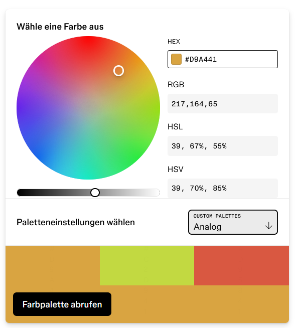

# Phase 2: Finales Design-System für Retroy

## Einführung

Dieses Dokument beschreibt das vollständige Design-System für die Retroy-Plattform. Es definiert alle visuellen Elemente, deren Anwendungsbereiche und technische Spezifikationen zur einheitlichen Implementierung. Das Design-System verkörpert die nostalgische, nachhaltige und hochwertige Positionierung der Marke und stellt sicher, dass alle digitalen Berührungspunkte konsistent gestaltet werden.

## Farbpalette mit Anwendungsbereichen

### Primärfarben

- **Verbranntes Orange (#C26A42)**
  - Primäre Call-to-Action-Buttons
  - Hauptnavigations-Aktivzustand
  - Wichtige interaktive Elemente
  - Hervorgehobene Produktmerkmale
  - Preisinformationen bei Rabatten

- **Gedämpftes Senfgelb (#D9A441)**
  - Sekundäre Buttons und Interaktionselemente
  - Aufmerksamkeitserregende Akzente
  - Ausgewählte Filter und Kategorien
  - Warnmeldungen und Hinweise
  - Dekorative Elemente bei Premium-Artikeln

- **Tiefes Mahagonibraun (#5E2B20)**
  - Hauptüberschriften (H1, H2)
  - Produktnamen und wichtige Bezeichnungen
  - Footer-Hintergrund
  - Rahmen für hochwertige Produkte
  - Designelemente für Exklusiv-Kollektionen

- **Verblasstes Olivgrün (#807B50)**
  - Nachhaltigkeitsindikatoren und -badges
  - Umweltbezogene Informationen
  - Kategoriebezeichnungen bei nachhaltigen Produkten
  - Hintergrundakzente für Umwelt-Content
  - Sekundäres Farbelement bei Produkt-Tags

- **Warmes Beige (#E4C9A0)**
  - Sektionshintergründe
  - Karten-Hintergründe für Produktbeschreibungen
  - Texturierte Oberflächen
  - Rahmenhintergründe für Vintage-Artikel
  - Hover-Zustände für neutrale Elemente

- **Vintage Rostrot (#9B3D30)**
  - Premium-Produktkennzeichnungen
  - Besondere Angebote und limitierte Kollektionen
  - Akzentfarbe für kuratierte Inhalte
  - Fehlermeldungen
  - Designelemente für historische Inhalte

### Neutralfarben

- **Neutral Dunkel (#2C231D)**
  - Haupttextfarbe
  - Icons und Symbole
  - Footertexte
  - Produktbeschreibungen
  - Überschriften in Textblöcken

- **Neutral Mittel (#8C7A6B)**
  - Sekundäre Texte
  - Inaktive UI-Elemente
  - Rahmen und Trennlinien
  - Bildunterschriften und Metadaten
  - Deaktivierte Zustände

- **Neutral Hell (#F5F1EA)**
  - Haupthintergrundfarbe
  - Textfarbe auf dunklen Hintergründen
  - Kartenhintergründe
  - Formularfelder
  - Trennelemente in hellen Bereichen

### Funktionsfarben

- **Erfolgsgrün (#5B7F65)**
  - Erfolgsmeldungen
  - Verfügbarkeitsstatus
  - Bestätigungsanzeigen
  - Nachhaltigkeitsbewertungen
  - Positive Indikatoren

## Typografie

### Schriftfamilien und Verwendung

- **Freight Text Pro**
  - Hauptüberschriften (H1-H3)
  - Produkttitel
  - Markenelemente
  - Besondere Beschreibungen
  - Zitate und Testimonials

- **Acumin Pro**
  - Fließtext und Produktbeschreibungen
  - UI-Elemente und Navigation
  - Buttons und Interaktionselemente
  - Formularbeschriftungen
  - Metainformationen

### Typografische Größen und Gewichte

1. **H1 - Hauptüberschriften**
   - Freight Text Pro Semibold, 32px/40px, Tiefes Mahagonibraun (#5E2B20)
   - Verwendung: Hauptseitentitel, Kollektionsbezeichnungen

2. **H2 - Sektionsüberschriften**
   - Freight Text Pro Semibold, 24px/32px, Tiefes Mahagonibraun (#5E2B20)
   - Verwendung: Abschnittsüberschriften, Kategorienseiten

3. **H3 - Unterabschnitte**
   - Freight Text Pro Medium, 20px/28px, Tiefes Mahagonibraun (#5E2B20)
   - Verwendung: Produktgruppen, wichtige Inhaltsblöcke

4. **H4 - Kartenüberschriften**
   - Acumin Pro Semibold, 18px/24px, Tiefes Mahagonibraun (#5E2B20)
   - Verwendung: Produktkartenüberschriften, Filterüberschriften

5. **Body - Primär**
   - Acumin Pro Regular, 16px/24px, Neutral Dunkel (#2C231D)
   - Verwendung: Haupttextblöcke, Produktbeschreibungen

6. **Body - Sekundär**
   - Acumin Pro Regular, 14px/22px, Neutral Mittel (#8C7A6B)
   - Verwendung: Ergänzende Informationen, Produktdetails

7. **Caption**
   - Acumin Pro Medium, 12px/16px, Neutral Mittel (#8C7A6B)
   - Verwendung: Bildunterschriften, Metadaten, kleine Labels

8. **Button Text**
   - Acumin Pro Medium, 14px/20px, kontextabhängige Farbe
   - Verwendung: Alle Schaltflächen und interaktive Elemente

## Layout und Raster

### Grundraster

- **Desktop (≥1200px)**
  - 12-Spalten-Raster
  - Gutters: 24px
  - Margins: 64px
  - Max. Inhaltsbreite: 1440px

- **Tablet (768-1199px)**
  - 8-Spalten-Raster
  - Gutters: 16px
  - Margins: 32px

- **Mobile (320-767px)**
  - 4-Spalten-Raster
  - Gutters: 16px
  - Margins: 16px

### Abstände

- **4px** - Minimaler Abstand (Badges, Icons)
- **8px** - Kleiner Abstand (eng verwandte Elemente)
- **16px** - Standard-Abstand (Listenelemente, Formularfelder)
- **24px** - Mittlerer Abstand (Karten-Padding, verwandte Sektionen)
- **32px** - Großer Abstand (Komponenten-Trennung)
- **48px** - Extra großer Abstand (Hauptsektionen)
- **64px** - Maximaler Abstand (Seitenränder Desktop, Hauptabschnitte)

## Komponenten

### Buttons

#### Primäre Buttons
- **Aussehen**: Vollflächig Verbranntes Orange (#C26A42), Text in Neutral Hell (#F5F1EA)
- **Größen**: 
  - Klein: 32px Höhe
  - Standard: 40px Höhe
  - Groß: 48px Höhe
- **Zustände**:
  - Normal: #C26A42
  - Hover: 10% dunkler
  - Active: 15% dunkler
  - Disabled: 50% Transparenz
- **Verwendung**: Hauptaktionen wie "In den Warenkorb", "Zur Kasse", "Jetzt kaufen"

#### Sekundäre Buttons
- **Aussehen**: Transparenter Hintergrund, 1.5px Rahmen in Verbranntem Orange (#C26A42)
- **Zustände**:
  - Normal: Transparent mit Rahmen
  - Hover: 10% Deckkraft der Füllfarbe
  - Active: 20% Deckkraft der Füllfarbe
- **Verwendung**: "Mehr erfahren", "Filtern", "Speichern"

#### Tertiäre Buttons (Text-Links)
- **Aussehen**: Nur Text in Vintage Rostrot (#9B3D30), keine Unterstreichung
- **Zustände**:
  - Hover: Unterstreichung
- **Verwendung**: "Details anzeigen", Inline-Links, "Bearbeiten"

### Formulare

#### Textfelder
- **Aussehen**: Neutral Hell (#F5F1EA) Hintergrund, 1px Rahmen in Neutral Mittel (#8C7A6B)
- **Zustände**:
  - Focus: 1.5px Rahmen in Gedämpftem Senfgelb (#D9A441)
  - Error: 1.5px Rahmen in Vintage Rostrot (#9B3D30)
- **Verwendung**: Alle Texteingaben, Suche, Formularfelder

#### Checkboxen und Radio-Buttons
- **Aussehen**: Benutzerdefiniertes Design mit nostalgischem Charakter
- **Aktiv**: Gedämpftes Senfgelb (#D9A441) für ausgewählte Zustände
- **Verwendung**: Auswahloptionen, Filter, Einstellungen

### Karten

#### Produktkarten
- **Aussehen**: 
  - Hintergrund: Neutral Hell (#F5F1EA)
  - Schatten: Subtil, 2px Versatz
  - Rundung: 8px
- **Elemente**:
  - Bild: Abgerundete Ecken (6px)
  - Titel: H4, Tiefes Mahagonibraun (#5E2B20)
  - Preis: Semibold 16px, Vintage Rostrot (#9B3D30)
  - Nachhaltigkeits-Badge: Kreisförmig, Verblasstes Olivgrün (#807B50)
- **Verwendung**: Produktlisten, Suchergebnisse, Empfehlungen

#### Inhaltskarten
- **Aussehen**:
  - Hintergrund: Warmes Beige (#E4C9A0) mit 30% Deckkraft
  - Rahmen: 1px Neutral Mittel (#8C7A6B) mit 20% Deckkraft
- **Verwendung**: Blog-Beiträge, Geschichten, Kollektionen

### Navigation

#### Hauptnavigation
- **Aussehen**:
  - Hintergrund: Neutral Hell (#F5F1EA)
  - Aktiv: Verbranntes Orange (#C26A42) Unterstreichung
- **Mobile**: Hamburger-Menü mit Animation
- **Verwendung**: Hauptmenü, Kategorien

#### Produktfilter
- **Aussehen**:
  - Rahmen: 1px Neutral Mittel (#8C7A6B)
  - Aktiv: Verbranntes Orange (#C26A42) Hintergrund oder Rahmen
- **Verwendung**: Kategorienseiten, Suchergebnisse

### Spezifische Komponenten

#### Nachhaltigkeits-Badge
- **Aussehen**: Kreisform mit Icon, Verblasstes Olivgrün (#807B50)
- **Varianten**: 3-5 Stufen zur Visualisierung des Nachhaltigkeitsgrads
- **Verwendung**: Produktkarten, Detailseiten

#### Zustandsindikator für Vintage-Artikel
- **Aussehen**: Abgerundetes Label mit Farbcodierung
- **Varianten**:
  - "Neuwertig": Gedämpftes Senfgelb (#D9A441)
  - "Sehr gut": Verbranntes Orange (#C26A42)
  - "Mit Patina": Vintage Rostrot (#9B3D30)
- **Verwendung**: Vintage-Artikel, Second-Hand-Produkte

#### Story-Element
- **Aussehen**: Vintage-Dokument-Stil mit Papierstruktur
- **Elemente**: Zeitlinie, Herkunftsgeschichte
- **Verwendung**: Produktdetailseiten, Markengeschichte

## Bildsprache

### Produktfotografie
- **Stil**: Natürliches Licht, authentische Darstellung
- **Hintergrund**: Neutrale, texturierte Oberflächen
- **Farbtemperatur**: Warm, leicht vintage-gefiltert
- **Verwendung**: Produktgalerien, Detailseiten

### Iconografie
- **Stil**: Feine Linienzeichnungen mit Vintage-Details
- **Strichstärke**: 1.5px
- **Farbe**: Primär Tiefes Mahagonibraun (#5E2B20)
- **Verwendung**: Navigation, UI-Elemente, Funktionsanzeigen

### Texturen
- **Papiertextur**: Leichte Körnung für Hintergründe
- **Stofftextur**: Für bestimmte Inhaltsblöcke
- **Holzmaserung**: Dekorative Elemente für Premium-Bereiche
- **Verwendung**: Hintergründe, Trennelemente, Akzente

## Animation und Interaktion

### Übergangsprinzipien
- **Timing-Funktion**: Ease-Out (cubic-bezier(0.25, 0.1, 0.25, 1))
- **Standarddauer**: 300ms
- **Verwendung**: Alle UI-Übergänge, Hover-Effekte

### Spezifische Animationen
- **Hover-Effekte**: Subtile Skalierung (1.02) für Karten
- **Seitenübergänge**: Sanftes Crossfading
- **Ladezustände**: Vintage-inspirierte Animation

## Responsive Design

### Desktop-Erlebnis
- **Layout**: Volle 12-Spalten-Nutzung
- **Produktdarstellung**: Großzügige Bilder, ausführliche Informationen
- **Navigation**: Vollständig sichtbar

### Tablet-Anpassungen
- **Layout**: Kompaktere 8-Spalten-Anordnung
- **Produktdarstellung**: Leicht reduzierte Bildgrößen
- **Navigation**: Teilweise komprimiert

### Mobile Optimierung
- **Layout**: Vertikaler Fluss im 4-Spalten-System
- **Produktdarstellung**: Fokus auf Bilder, essentielle Informationen
- **Navigation**: Hamburger-Menü, vereinfachte Filter

## Implementierungsrichtlinien

### SCSS-Variablen-System
Alle Design-Elemente werden als SCSS-Variablen definiert:

```scss

// Typografie
$font-heading: 'Freight Text Pro', serif;
$font-body: 'Acumin Pro', sans-serif;

// Abstände
$spacing-xs: 4px;
$spacing-sm: 8px;
$spacing-md: 16px;
$spacing-lg: 24px;
$spacing-xl: 32px;
$spacing-xxl: 48px;
$spacing-xxxl: 64px;

// Übergänge
$transition-standard: all 300ms cubic-bezier(0.25, 0.1, 0.25, 1);
```

### Komponenten-Struktur
Komponenten werden nach BEM-Methodik modular strukturiert:

```scss
.product-card {
  background-color: $color-neutral-light;
  border-radius: 8px;
  box-shadow: 0 2px 4px rgba($color-neutral-dark, 0.1);
  transition: $transition-standard;
  
  &__image { }
  &__content { }
  &__title { }
  &__price { }
  &__badge { }
  
  &--featured { }
}
```

## Nächste Schritte

1. **Entwicklung der Komponentenbibliothek**:
   - Erstellung aller UI-Komponenten gemäß Design-System
   - Integration in ein Storybook zur Dokumentation

2. **Prototypen für Hauptseiten**:
   - Homepage mit Fokus auf Markenwerten
   - Kategorie-Übersicht mit Filterfunktionen
   - Produktdetailseite mit Story-Element
   - Warenkorb und Checkout-Prozess

3. **Usability-Tests**:
   - Validierung des Designs mit Vertretern der Zielgruppen
   - Iteration basierend auf Feedback

4. **Dokumentation**:
   - Detaillierte Stilrichtlinien für das Entwicklungsteam
   - Anwendungsbeispiele und Best Practices

---



Dieses finale Design-System bildet die Grundlage für die konsistente Entwicklung aller digitalen Berührungspunkte der Retroy-Plattform. Es verkörpert die Markenwerte Nachhaltigkeit, Qualität und Individualität und bietet gleichzeitig ein intuitives, ansprechendes Nutzererlebnis.